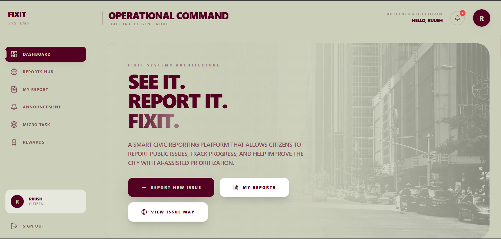
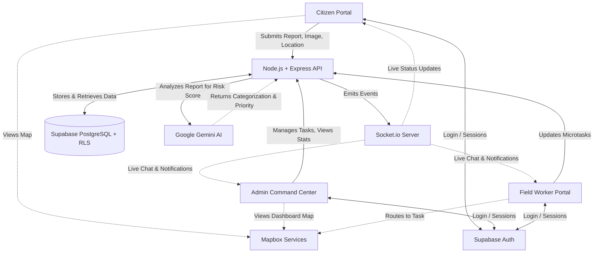

# FixIt – Smart Civic Issue Management Platform

> **An AI-Powered Civic Issue Management & Predictive Analytics Platform**

FixIt is a full-stack web platform designed to streamline the process of reporting, managing, and resolving civic issues by connecting citizens, administrators, and field workers in a single unified system.

---

## 🚨 Problem Statement

Urban areas frequently face issues such as potholes, garbage accumulation, broken infrastructure, and water leakages. However, existing systems often lack:
- Easy reporting mechanisms for citizens.
- Transparency in issue tracking.
- Efficient coordination between authorities and workers.

This leads to delayed resolutions and reduced trust in civic systems.

---

## 💡 Our Solution

ZapFlux provides a structured and transparent workflow where:
1. **Citizens** can report issues by uploading images and location.
2. **The system** analyzes the issue using AI.
3. **Admins** verify and assign the task to workers.
4. **Workers** resolve the issue and upload proof.
5. **Citizens** can track and verify the resolution.

This creates a complete lifecycle from reporting to resolution.

---

## ✨ Key Features

### 📸 Smart Issue Reporting
- Citizens can report issues with image, description, and exact location.
- AI-based detection using **Google Gemini** helps identify and categorize issues automatically.
- Generates intelligent risk scores for prioritization and predicts potential cascading hazards.

### 🧑‍💼 Admin Dashboard (Command Center)
- View all reported issues in real time on an interactive map.
- Assign tasks to workers or utilize automated AI routing based on proximity and urgency.
- Monitor progress and escalation.
- Send broadcast alerts to citizens (to specific zones or city-wide).
- Analyze issue trends, risk scores, and system activity.

### 🛠 Worker Dashboard
- View assigned tasks with complete details.
- Update task status (Assigned → In Progress → Completed) directly from the field.
- Manage microtasks and upload resolution proof images.
- Real-time chat with administrators for seamless coordination.
- Track work history and performance.

### 🔄 End-to-End Transparency
- Citizens can track the real-time status of their personal reports.
- Before-and-after images ensure visual proof of resolution.
- Direct communication via real-time updates between admins and the community.

### ⚡ Microtasks & Community Engagement
- Admins can create small tasks for citizens.
- Citizens contribute by verifying issues or providing updates.
- Encourages crowdsourced civic monitoring.

### 🏆 Rewards & Leaderboard
- Citizens earn points for participation and reporting.
- Leaderboard promotes positive community engagement and accountability.

### 🔔 Broadcast & Notifications
- Admins can send alerts and announcements.
- Real-time WebSocket notifications for:
  - New reports
  - Status updates
  - Task assignments

---

## 🛠️ Technology Stack

- **Frontend:** React + Vite, TypeScript, Tailwind CSS, Mapbox GL
- **Backend:** Node.js, Express, Socket.io (WebSocket Server)
- **Database & Auth:** Supabase (PostgreSQL with Row Level Security)
- **AI Integration:** Google Gemini
- **Deployment:** Render

---

## 🌍 Impact

ZapFlux improves civic management by:
- Enabling fast and easy issue reporting.
- Ensuring transparent resolution tracking.
- Reducing response time for authorities.
- Encouraging active citizen participation.
- Supporting data-driven decision-making.

---

## 📋 Prerequisites

Before you begin, ensure you have met the following requirements:
- **Node.js** (v18.0.0 or higher) & **npm**
- **Git**
- A **Supabase** account and project setup
- A **Google Gemini API Key**
- A **Mapbox Access Token**

---
## 🏗️ Project Architecture Overview

1. **Citizen Request Flow:** A citizen submits a report -> Stored in Supabase -> Backend invokes Gemini AI for risk scoring.
2. **Task Routing:** High-risk issues immediately alert Admins via WebSockets. Routine issues are auto-routed to the nearest available field worker.
3. **Resolution Lifecycle:** Worker accepts task -> Updates microtasks (en route, investigating, resolving) -> Real-time status reflects on Citizen and Admin dashboards.

---

## 🎯 Conclusion

ZapFlux transforms the way civic issues are handled by creating a connected ecosystem of citizens, administrators, and workers. With AI-powered detection, real-time updates, and community engagement, it moves toward building a smarter and more responsive urban environment.

---
*Built with ❤️ for smarter, safer, and cleaner cities.*
